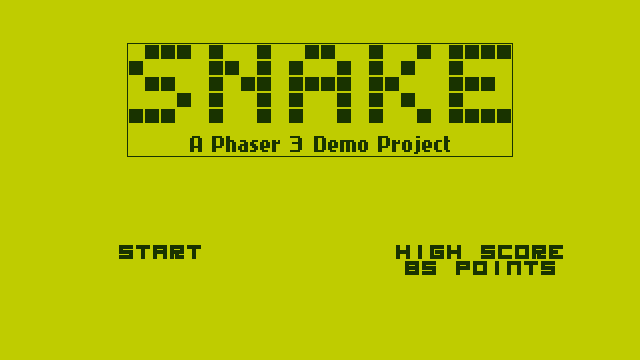
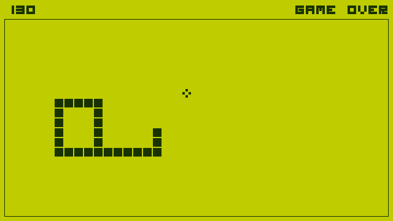

# [Snake Game: A Phaser 3 Demo][game]  

A [Phaser 3][phsr] demonstration project powered by [Gulp][gulp] and [Webpack][wbpk], based on the tutorial titled "Snake Plissken", published on [Phaser World #85][pw85].

    
Screenshots

    

    

>   NOTE: This repository is **not** a Phaser 3 project template. If you're looking for a easier way to start a new game project from scratch, try [`generator-phaser-plus`][gpp_].

## Game Controls

Use the left (<kbd>←</kbd>) and right (<kbd>→</kbd>) arrow keys to rotate and change direction.

For every five pieces of food eaten, the speed increases.

## Instructions for Developers

>   NOTE: It is highly recommended that you have at least Node.js version 6.11 installed, and [Yarn](https://yarnpkg.com/) to manage this project.

First, clone this repository and install the project dependencies using `yarn`. To play the sample game, just run `yarn start`.

## License

Distributed under the terms of the [MIT License](LICENSE.md). Portions of the game code are derived from a previous work by Richard Davey ([@photonstorm](https://github.com/photonstorm)).

[wbpk]: https://webpack.js.org/
[pw85]: https://madmimi.com/p/03594a
[gulp]: https://github.com/gulpjs/gulp
[phsr]: https://github.com/photonstorm/phaser
[game]: https://rblopes.github.io/phaser-3-snake-game/
[gpp_]: https://github.com/rblopes/generator-phaser-plus
